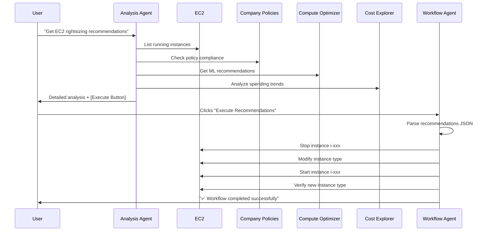

# Brickwatch - Multi-Agent Autonomous FinOps Platform

> **"What if your cloud spend tuned itself?"**

Brickwatch is a **multi-agent AI system** that goes beyond reporting. It **interprets, recommends, and carries out** AWS cost optimizations end-to-end. Built on AWS Bedrock AgentCore and the Strands Agents SDK, it showcases agentic workflows for intelligent cost control.

## 💼 The Vision

Most FinOps tools show charts. **Brickwatch acts as an AI co-pilot** that:

- **Analyzes** your AWS footprint with company policies, AWS Compute Optimizer, and spend trends
- **Discusses** opportunities in natural language
- **Executes** approved recommendations across AWS services
- **Validates** every change to stay safe and compliant

**The key idea:** two specialized AI agents working together - one for reasoning, one for execution.

---

## ⚙️ Architecture

Brickwatch runs as a 5-layer system:

### Architecture Diagram

_Architecture diagram omitted in this repository snapshot._

### Runtime Components

1. `webapp` (Vite SPA): chat UI and auth token handling.
2. `BrickwatchApi` (API Gateway + Lambda): ingress, CORS, auth header pass-through, async workflow kickoff.
3. `BrickwatchAgentCore` (Bedrock AgentCore runtime): analysis/recommendation agent.
4. `BrickwatchWorkflowAgent` (Bedrock AgentCore runtime): execution agent for approved actions.
5. Supporting control plane: Cognito (JWT), SSM Parameter Store (agent IDs/aliases/ARNs), ECR + CodeBuild (container build/publish), CloudWatch/X-Ray (observability).

### Deployment Graph (Current CDK App)

- `BrickwatchIam`: shared execution/read roles.
- `BrickwatchApi`: API Lambda + API Gateway + API key/usage plan.
- `BrickwatchAgentCore`: analysis runtime + Cognito user pool/client/domain + SSM params under `/rita/agentcore/*`.
- `BrickwatchWorkflowAgent`: workflow runtime (reuses Cognito from analysis stack) + SSM params under `/rita/workflow-agent/*`.
- `BrickwatchUi` (optional): CloudFront + private S3 static site; requires API URL and Cognito context.
- `BrickwatchSageMaker` (optional): only deployed when `sagemaker_artifacts/` exists.

### Request Flows

1. Analysis:
   `UI -> POST /v1/chat -> API Lambda -> AgentCore Gateway (Brickwatch analysis runtime) -> response to UI`
2. Execution:
   `UI -> POST /v1/automation -> API Lambda`
   `API Lambda self-invokes asynchronously -> invokes BrickwatchWorkflow runtime -> executes EC2/S3/Lambda/RDS actions`
3. Analytics:
   `UI/API consumer -> GET /v1/analyze -> API Lambda -> Cost Explorer/Compute Optimizer/CloudWatch`

### Why Two Agents?

- Analysis agent (`agentcore_runtime/app.py`) is tuned for reasoning, recommendation quality, and policy interpretation.
- Workflow agent (`workflow_runtime/app.py`) is tuned for deterministic execution and lower-cost repeated operations.
- Separating them keeps long-running actions off the user-facing analysis path and avoids API timeout coupling.

---

## ✨ Key Features

### 1. Policy-Driven Intelligence

Brickwatch enforces **company cost policies** defined in `agentcore_runtime/company_policies.py`:

```python
"EC2": {
    "allowed_instance_types": ["t3.micro", "t3.small", "t3.medium"],
    "disallowed_families": ["r5.*", "m5.*", "c5.*", "t2.*"],
    "max_instance_size": "medium",
    "policy_rationale": "Cost optimization - T3 instances provide best price/performance for our workloads"
}
```

**Immediate recommendations** without waiting for 14 days of data. The Analysis Agent also flags anomalies using AWS Cost Explorer, CloudWatch, and more.

### 2. Multi-Service Support

Through Workflow Agent tools, you can codify actions and execute the right optimization steps. This starter kit demonstrates:

- **EC2**: Instance rightsizing and policy compliance
- **Lambda**: Memory and concurrency tuning
- **S3**: Lifecycle and storage class optimization

### 3. Autonomous Execution

The Workflow Agent can autonomously apply approved recommendations, reducing manual work while enforcing policy.

**Example Scenario:**

1. Ask: _"Which EC2 instances violate our cost policy?"_
2. Agent analyzes and returns violations
3. Click **"Execute Recommendations"** in chat
4. Workflow Agent performs:
   - Instance stop
   - Type modification
   - Instance restart
   - Verification

### 4. Smart Recommendations

The Analysis Agent blends:
- **Company cost policies** (primary signal)
- **AWS Compute Optimizer** (ML insights)
- **Cost Explorer trends** (historical spend)
- **CloudWatch metrics** (utilization)

### 5. Secure by Default

- **Cognito authentication** for all API calls
- **IAM least-privilege** roles per component
- **Approval-based workflow** - no changes without consent
- **Audit trail** in CloudWatch Logs

---

## 📂 Project Structure

``` 
finops-agent/
│
├── infra/                          # CDK app (Python)
│   ├── app.py                      # Stack composition + dependency wiring
│   ├── stacks/
│   │   ├── iam_roles.py            # BrickwatchIam
│   │   ├── api.py                  # BrickwatchApi
│   │   ├── agentcore.py            # BrickwatchAgentCore (+ Cognito)
│   │   ├── workflow_agent.py       # BrickwatchWorkflowAgent
│   │   ├── ui_hosting.py           # BrickwatchUi (CloudFront + S3)
│   │   └── sagemaker.py            # Optional BrickwatchSageMaker
│   └── custom-resources/
│       └── agentcore_provisioner/ # AgentCore provisioning Lambda
│
├── agentcore_runtime/             # Analysis Agent Runtime
│   ├── app.py                     # Agent definition + tools
│   ├── company_policies.py        # Multi-service cost policies
│   ├── Dockerfile                 # Container for AgentCore
│   └── requirements.txt           # Python dependencies
│
├── workflow_runtime/              # Workflow Agent Runtime
│   ├── app.py                     # Execution agent + AWS tools
│   ├── Dockerfile                 # Container for AgentCore
│   └── requirements.txt           # Python dependencies
│
├── api/                           # API Lambda (Orchestrator)
│   ├── src/
│   │   ├── app.py                 # Starlette app with routes
│   │   ├── agentcore/
│   │   │   └── client.py          # AgentCore gateway client
│   │   ├── automation/
│   │   │   ├── strands_runner.py  # Strands SDK wrapper
│   │   │   ├── strands_workflows.py # Workflow step definitions
│   │   │   └── multi_service_workflows.py
│   │   └── services/
│   │       ├── analytics.py        # Cost analysis logic
│   │       ├── aws.py              # AWS session helpers
│   │       └── recommendations.py # Compute Optimizer integration
│   ├── Dockerfile.api             # API Lambda container
│   └── requirements.txt
│
├── webapp/                        # Vite SPA frontend
│   ├── src/
│   │   └── main.js                # Chat UI + API integration
│   ├── index.html
│   └── package.json
│
└── test/                          # AWS resource setup/cleanup scripts
```

---

## 🔧 Technology Stack

### Core Technologies

| Component | Technology | Purpose |
|-----------|-----------|---------|
| **Analysis Agent** | AWS Bedrock AgentCore + Amazon Nova Pro | High-intelligence reasoning for cost analysis |
| **Workflow Agent** | AWS Bedrock AgentCore + Amazon Nova Lite | Lightweight execution engine |
| **Orchestration** | AWS Strands Agents SDK | Multi-step workflow coordination |
| **API Layer** | Python (Starlette + Mangum) | Lambda-based REST API |
| **Frontend** | Vanilla JS + Vite | Lightweight SPA chat interface |
| **Infrastructure** | AWS CDK v2 (Python) | Infrastructure as code |
| **Authentication** | Amazon Cognito | User identity and JWT tokens |
| **CDN+UI** | CloudFront + S3 | Static site hosting |
| **Container Registry** | Amazon ECR | Docker image storage for Lambda |

### AWS Services Used

- **Bedrock AgentCore** - Agent runtimes and orchestration
- **Cost Explorer** - Historical cost data and anomalies
- **Compute Optimizer** - ML-based rightsizing recommendations
- **CloudWatch** - Metrics and logging
- **EC2, RDS, Lambda, S3, EBS** - Resource optimization targets
- **IAM** - Security and permissions
- **API Gateway** - HTTP endpoints
- **Lambda** - Serverless compute
- **Systems Manager (SSM)** - Parameter store for configuration

---

## 🚀 Quick Start Deployment

### Prerequisites

```bash
# Required tools
node --version        # v18 or higher
python --version      # 3.11 or higher
aws --version         # AWS CLI v2
cdk --version         # AWS CDK v2

# Install CDK globally if needed
npm install -g aws-cdk

# Configure AWS credentials
aws configure
```

### Deployment Overview

Deploy the stacks in order so the AgentCore stacks can reference the API URL.

**Estimated deployment time:** 15-20 minutes (mostly building Docker images)

### Post-Deployment Setup

After deployment, create a test user for authentication:

```bash
# Get your User Pool ID from the deployment output, then create a test user
aws cognito-idp admin-create-user \
  --user-pool-id <your-user-pool-id> \
  --username <test-email@example.com> \
  --user-attributes Name=email,Value=<test-email@example.com> Name=email_verified,Value=true \
  --temporary-password '<YourTempPassword123!>'
```

**Note:** Replace the placeholders with:
- `<your-user-pool-id>`: Found in deployment output or CloudFormation stack outputs
- `<test-email@example.com>`: Your test email address
- `<YourTempPassword123!>`: A temporary password (user will be prompted to change on first login)

### Manual Deployment (Step-by-Step)

If you prefer manual control:

```bash
# 1. Install dependencies
cd infra && pip install -r requirements.txt && cd ..
cd api && pip install -r requirements.txt && cd ..
cd webapp && npm install && cd ..

# 2. Bootstrap CDK (once per account/region)
cd infra
npx cdk bootstrap

# 3. Deploy IAM + API first
npx cdk deploy BrickwatchIam --require-approval never
npx cdk deploy BrickwatchApi --require-approval never

# 4. Read API URL from stack outputs and deploy agent stacks + UI
npx cdk deploy BrickwatchAgentCore -c apiUrl=https://<api-id>.execute-api.<region>.amazonaws.com/prod --require-approval never
npx cdk deploy BrickwatchWorkflowAgent -c apiUrl=https://<api-id>.execute-api.<region>.amazonaws.com/prod --require-approval never
npx cdk deploy BrickwatchUi -c apiUrl=https://<api-id>.execute-api.<region>.amazonaws.com/prod --require-approval never

# 5. Optional: SageMaker (only if sagemaker_artifacts exists)
npx cdk deploy BrickwatchSageMaker --require-approval never
```

---

## 💻 How to Use

### 1. Access the UI

Navigate to your CloudFront URL (output from deployment):
```
https://<your-cloudfront-distribution-id>.cloudfront.net
```

### 2. Authenticate

1. Click **"Sign in with Cognito"**
2. Create an account or sign in (see setup instructions below)
3. Your ID token is saved in the session

**Create a test user** (replace placeholders with your values):
```bash
aws cognito-idp admin-create-user \
  --user-pool-id <your-user-pool-id> \
  --username <test-email@example.com> \
  --user-attributes Name=email,Value=<test-email@example.com> Name=email_verified,Value=true \
  --temporary-password '<YourTempPassword123!>'
```

### 3. Ask Questions

Try these conversational queries:

**Cost Analysis:**
```
"Show me my AWS spending trends for the last 30 days"
"Find cost anomalies in my account"
"What's causing my EC2 costs to spike?"
```

**Optimization:**
```
"Get rightsizing recommendations for all my EC2 instances"
"What resources violate our company cost policy?"
"Analyze my S3 buckets for cost savings"
"Are my Lambda functions over-provisioned?"
```

**Multi-Service:**
```
"Give me all cost optimization opportunities across EC2, RDS, and Lambda"
"What are my top 5 cost savings recommendations?"
```

### 4. Execute Recommendations

1. Agent responds with analysis
2. **"Execute Recommendations"** button appears in chat (only if recommendations exist)
3. Click button -> Workflow Agent runs in the background
4. Check EC2 console to see instances being optimized (3-5 minutes)

---

## 🔄 How It Works

### The Recommendation Flow



### The Intelligence

**Analysis Agent System Prompt** (excerpt):
```
"When users ask about rightsizing, you MUST:
1. Use get_rightsizing_recommendations to check company policies
2. Write a CONVERSATIONAL, well-explained response
3. Include resource inventory, policy violations, and estimated savings
4. End with [RECOMMENDATIONS_JSON]...[/RECOMMENDATIONS_JSON] and [BUTTON:Execute Recommendations]"
```

**Workflow Agent System Prompt** (excerpt):
```
"You receive recommendations as JSON. Your job:
1. Parse and understand what needs to be done
2. Use your tools to execute changes (EC2, S3, Lambda)
3. Verify each change was successful
4. Report results in natural language"
```

---

## 📋 Company Cost Policies

Define your optimization rules in `agentcore_runtime/company_policies.py`:

```python
COMPANY_COST_POLICIES = {
    "EC2": {
        "allowed_instance_types": ["t3.micro", "t3.small", "t3.medium"],
        "disallowed_families": ["r5.*", "m5.*", "c5.*", "t2.*"],
        "max_instance_size": "medium",
        "policy_rationale": "T3 instances provide best price/performance",
        "estimated_savings_per_violation": "$50.00/month"
    },
    "RDS": {
        "allowed_instance_classes": ["db.t3.*", "db.t4g.*"],
        "disallowed_engines_for_large_instances": ["aurora-postgresql", "aurora-mysql"],
        "max_allocated_storage_gb": 500
    },
    "Lambda": {
        "max_memory_mb": 1024,
        "max_timeout_seconds": 300,
        "reserved_concurrency_policy": "discouraged"
    },
    "S3": {
        "lifecycle_policy_required": True,
        "disallowed_storage_classes": ["GLACIER_IR", "DEEP_ARCHIVE"],
        "transition_to_ia_after_days": 90
    },
    "EBS": {
        "allowed_volume_types": ["gp3"],
        "disallowed_volume_types": ["io1", "io2"],
        "max_volume_size_gb": 500
    }
}
```

The agent **automatically checks these policies** and provides instant recommendations - no metrics required.

---

## ⚙️ Configuration

### Enable AWS Services

**1. Compute Optimizer** (required for ML-based recommendations):
  ```bash
  aws compute-optimizer update-enrollment-status \
    --status Active \
    --include-member-accounts \
    --region us-east-1
  ```

**2. Cost Explorer** (automatically enabled, but check):
```bash
aws ce get-cost-and-usage \
  --time-period Start=2025-01-01,End=2025-01-02 \
  --granularity DAILY \
  --metrics BlendedCost
```

### Environment Variables

After deployment, these are automatically configured in SSM Parameter Store:

| Parameter | Description |
|-----------|-------------|
| `/rita/agentcore/id` | Analysis Agent ID |
| `/rita/agentcore/alias` | Analysis Agent alias (prod) |
| `/rita/agentcore/invoke-arn` | Analysis Agent endpoint ARN |
| `/rita/workflow-agent/id` | Workflow Agent ID |
| `/rita/workflow-agent/invoke-arn` | Workflow Agent endpoint ARN |

---

## ✅ Testing & Validation

### Create a Test Instance

Run the helper script to create a policy-violating instance:

```bash
node create-test-instance.js
```

This creates an `r5.large` instance (violates policy -> should recommend `t3.medium`).

### Test the Full Flow

1. **Ask**: _"Get rightsizing recommendations for all my EC2 instances"_

   **Expected**: Agent finds the `r5.large` violation and recommends `t3.medium`

2. **Click**: "Execute Recommendations" button

   **Expected**: Workflow starts, instance is stopped -> modified -> restarted

3. **Verify**: Check EC2 console - instance type changed to `t3.medium`

4. **Ask again**: _"Get rightsizing recommendations for all my EC2 instances"_

   **Expected**: Agent says "All instances are compliant" with **NO button**

### Sample Questions for Testing

**EC2:**
```
"Show me all EC2 instances that violate company policy"
"What's the estimated savings from rightsizing my instances?"
"Get EC2 optimization recommendations"
```

**S3:**
```
"Analyze my S3 buckets for cost optimization"
"Which S3 buckets should use lifecycle policies?"
```

**Lambda:**
```
"Optimize my Lambda functions for cost"
"Which Lambda functions are over-provisioned?"
```

**Multi-Service:**
```
"Give me all cost optimization recommendations"
"What are my top cost savings opportunities?"
```

---

## 🔐 Authentication Flow

```
1. User visits CloudFront URL
   ↓
2. Clicks "Sign in with Cognito"
   ↓
3. Cognito Hosted UI (OAuth2)
   ↓
4. Returns ID token in URL fragment
   ↓
5. Frontend extracts and stores token
   ↓
6. All API calls include: Authorization: Bearer <token>
   ↓
7. API Lambda validates token with Cognito
   ↓
8. Agents receive authenticated context
```

**Both agents share the same Cognito User Pool** for seamless authentication.

**User Pool ID:** `<your-user-pool-id>` (found in deployment outputs)

---

## 🤖 Agent Details

### Analysis Agent (Brickwatch)

**Location:** `agentcore_runtime/app.py`

**Model:** `amazon.nova-pro-v1:0`

**Tools:**
- `analyze_aws_costs` - Cost Explorer trends and anomalies
- `get_cost_anomalies` - Detect spending spikes
- `get_rightsizing_recommendations` - Policy + Optimizer insights
- `execute_rightsizing_workflow` - Trigger Workflow Agent

**Response Format:**
```json
{
  "brand": "Brickwatch",
  "message": "Conversational analysis with markdown formatting...",
  "button": {
    "text": "Execute Recommendations",
    "action": "rightsizing_workflow",
    "recommendations": [
      {
        "resource_type": "EC2",
        "instance_id": "i-xxx",
        "current_instance_type": "r5.large",
        "recommended_instance_type": "t3.medium",
        "estimated_monthly_savings": "$50.00"
      }
    ]
  }
}
```

### Workflow Agent (BrickwatchWorkflow)

**Location:** `workflow_runtime/app.py`

**Model:** `amazon.nova-lite-v1:0`

**Tools:**
- `stop_ec2_instances` - Gracefully stop instances
- `modify_ec2_instance_type` - Change instance type
- `start_ec2_instances` - Restart instances
- `verify_ec2_instance_type` - Confirm changes
- `apply_s3_lifecycle_policy` - Update S3 lifecycle
- `update_lambda_concurrency` - Adjust Lambda settings

**Execution Pattern:**
```
Input: Recommendations JSON array
  ↓
LLM interprets what needs to be done
  ↓
Calls appropriate tools (ec2_stop, ec2_modify, etc.)
  ↓
Verifies changes were applied
  ↓
Returns natural language summary
```

---

## 📊 Monitoring & Debugging

### CloudWatch Logs

**Analysis Agent Logs:**
```
/aws/bedrock-agentcore/Brickwatch-<agent-id>
```

**Workflow Agent Logs:**
```
/aws/bedrock-agentcore/BrickwatchWorkflow-<agent-id>
```

**API Lambda Logs:**
```
/aws/lambda/RitaApi-RitaApiFn-<random-suffix>
```

### Useful Log Queries

**Find workflow executions:**
```
fields @timestamp, @message
| filter @message like /Workflow execution/
| sort @timestamp desc
```

**Track recommendation processing:**
```
fields @timestamp, @message
| filter @message like /recommendations/
| sort @timestamp desc
```

---

## ⚡ Workflow Execution Details

### Synchronous vs. Asynchronous

**Current Implementation:**

1. **User clicks button** -> Frontend calls `/v1/automation`
2. **API Lambda** -> Invokes itself asynchronously with recommendations
3. **API Lambda (async)** -> Calls Workflow Agent
4. **API Lambda** -> Returns `202 Accepted` immediately to frontend
5. **Workflow Agent** -> Executes in background (3-5 minutes)

**Benefit:** No timeout errors, fast UI response

**Trade-off:** Generic static message, not intelligent Workflow Agent response

### Timeout Behavior

- **API Gateway timeout:** 29 seconds (hard limit)
- **Lambda timeout:** 300 seconds (5 minutes)
- **Workflow execution time:** 3-5 minutes typically

If workflow takes > 29 seconds, API Gateway returns `504 Gateway Timeout`, but:
- ✅ **Lambda keeps running** in the background
- ✅ **Changes still get applied** to AWS resources
- ✅ **Results logged** to CloudWatch

---

## 🔒 IAM Permissions

### Analysis Agent Role

```yaml
Permissions:
  - cost-explorer:GetCostAndUsage
  - cost-explorer:GetAnomalies
  - compute-optimizer:GetEC2InstanceRecommendations
  - ec2:DescribeInstances
  - cloudwatch:GetMetricStatistics
  - ssm:GetParameter
```

### Workflow Agent Role

```yaml
Permissions:
  - ec2:StopInstances
  - ec2:StartInstances
  - ec2:ModifyInstanceAttribute
  - s3:PutLifecycleConfiguration
  - lambda:UpdateFunctionConfiguration
  - rds:ModifyDBInstance
  - ec2:ModifyVolume
  - cloudwatch:GetMetricStatistics
```

### API Lambda Role

```yaml
Permissions:
  - bedrock-agentcore:InvokeAgentRuntime
  - ssm:GetParameter
  - lambda:InvokeFunction (self-invoke for async)
```

---

## 🔌 Extending Brickwatch

### Adding a New Service (e.g., DynamoDB)

**1. Define Policy** (`agentcore_runtime/company_policies.py`):
```python
"DynamoDB": {
    "on_demand_vs_provisioned": "on_demand_preferred",
    "max_provisioned_rcu": 100,
    "max_provisioned_wcu": 100
}
```

**2. Add Analysis Tool** (`agentcore_runtime/app.py`):
```python
@tool
def get_dynamodb_recommendations() -> Dict[str, Any]:
    """Get DynamoDB cost optimization recommendations."""
    # Check tables against policy
    # Return recommendations
```

**3. Add Workflow Tool** (`workflow_runtime/app.py`):
```python
@tool
def update_dynamodb_capacity(table_name: str, mode: str) -> Dict[str, Any]:
    """Switch DynamoDB table to on-demand billing."""
    # Update table billing mode
    # Verify change
```

**4. Update System Prompts** - Teach both agents about DynamoDB

**5. Deploy** - Both agents auto-reload with new capabilities

---

## 💰 Cost Optimization Strategies

Brickwatch applies standard FinOps best practices:

### 1. **Policy-First Approach**
- Define guardrails upfront (instance types, sizes, families)
- Get **immediate recommendations** without historical data
- Enforce consistent cost rules across teams

### 2. **Multi-Source Evidence**
- Company policies (organizational rules)
- Compute Optimizer (AWS ML insights)
- CloudWatch metrics (actual usage)
- Cost Explorer (spending patterns)

### 3. **Safe Automation**
- **Approval required** before any changes
- **Graceful stop** -> modify -> start sequence
- **Verification step** after each change
- **CloudWatch logging** for audit trail

### 4. **Service-Agnostic Design**
- Same workflow pattern for EC2, Lambda, S3
- Workflow Agent interprets any recommendation type
- Easy to extend to new services

---

## 📚 Learning Resources

### Understanding the Code

**Start here:**
1. `agentcore_runtime/app.py` - Analysis Agent definition
2. `workflow_runtime/app.py` - Workflow Agent definition
3. `api/src/app.py` - API orchestration logic
4. `webapp/src/main.js` - Frontend chat implementation

**Key concepts:**
- **AgentCore Entrypoints**: Functions decorated with `@bedrock_agentcore_app.entrypoint()`
- **Strands Tools**: Functions decorated with `@tool` that agents can invoke
- **Button Markers**: Special strings in responses that trigger UI buttons
- **Async Workflows**: Lambda self-invocation pattern for long-running tasks

### AWS Documentation

- [Bedrock AgentCore Guide](https://docs.aws.amazon.com/bedrock/latest/userguide/agents-agentcore.html)
- [Strands Agents SDK](https://docs.aws.amazon.com/bedrock/latest/userguide/agents-strands.html)
- [Cost Explorer API](https://docs.aws.amazon.com/cost-management/latest/APIReference/)
- [Compute Optimizer](https://docs.aws.amazon.com/compute-optimizer/latest/ug/)

---

## 🔍 Troubleshooting

### Common Issues

**1. "No response generated"**
- **Cause:** AgentCore runtime not deployed or failed
- **Fix:** Check CloudFormation stack status, redeploy AgentCore

**2. "504 Gateway Timeout" when executing workflow**
- **Cause:** Workflow takes > 29 seconds (expected behavior)
- **Status:** Workflow still runs in background, check EC2 console

**3. Button doesn't appear**
- **Cause:** Agent's response doesn't contain button marker
- **Fix:** Check CloudWatch logs for Analysis Agent, ensure `[BUTTON:Execute Recommendations]` is in response

**4. "Access Denied" errors**
- **Cause:** Missing IAM permissions
- **Fix:** Check agent role has required permissions for the service

**5. Circular dependency during deployment**
- **Cause:** Lambda trying to reference itself
- **Fix:** Use wildcard ARN pattern instead of `functionArn`

### Debug Mode

View full responses in the UI by clicking "Show Details" under each message.

---

## 🎯 Future Enhancements

### Recommended Roadmap

**Phase 1: Enhanced Intelligence** (Current)
- ✅ Multi-agent architecture
- ✅ Policy-based recommendations
- ✅ EC2 rightsizing automation

**Phase 2: Additional Services**
- ⏳ RDS database instance optimization (code available as reference in `agentcore_runtime/app.py`)
- ⏳ EBS volume type and unattached volume cleanup (code available as reference in `agentcore_runtime/app.py`)

**Phase 3: Advanced Features**
- ⏰ Scheduled optimizations (nightly shutdowns)
- 📊 Workflow execution history (DynamoDB table)
- 🔔 SNS notifications for completed workflows
- 📈 Cost savings dashboard
- 🔄 Real-time progress updates (WebSocket or polling)

**Phase 4: Enterprise Features**
- 👥 Multi-user support with RBAC
- 🏢 Multi-account optimization (AWS Organizations)
- 📝 Approval workflows (manager sign-off)
- 📊 Executive reporting and KPIs

---

## 💡 Why Brickwatch Matters

### The Problem with Traditional FinOps

- ❌ **Dashboards show data, not insights** - "Here's your spend... now what?"
- ❌ **Recommendations require expertise** - Teams must interpret and act
- ❌ **Manual execution is error-prone** - Console clicking leads to mistakes
- ❌ **Policies are informal** - "We should use t3 instances" = tribal knowledge

### The Brickwatch Solution

- ✅ **Conversational intelligence** - Ask questions, get answers
- ✅ **Automated execution** - One click to optimize
- ✅ **Policy enforcement** - Codified rules, not suggestions
- ✅ **Multi-service coverage** - EC2, S3, Lambda, etc
- ✅ **Autonomous agents** - Runs continuously

### Real-World Impact

**Before Brickwatch:**
- Ops team spends 4 hours/week reviewing cost reports
- Manual rightsizing of 20 instances: 2 hours
- Policy violations found weeks later
- **Total time:** 6+ hours/week

**After Brickwatch:**
- Ask agent: "What should I optimize?" - 30 seconds
- Click "Execute Recommendations" - 5 seconds
- Workflow runs in background - 0 team time
- **Total time:** 35 seconds/week

**Savings: 35 hours/month of engineering time** 🎉

---

## 🤝 Contributing

This is a reference implementation showcasing:
- Multi-agent architecture patterns
- AgentCore + Strands integration
- Policy-driven automation
- Service-agnostic workflow design

**Ideas for contributions:**
- Additional AWS service integrations (EKS, ECS, ElastiCache)
- Enhanced UI features (charts, graphs, history)
- Workflow execution tracking (DynamoDB state management)
- Cost allocation tag analysis
- Budget threshold automation

---

## 📄 License

MIT License - See LICENSE file

---

<div align="center">

**Brickwatch** - *Where AI meets FinOps*

</div>
